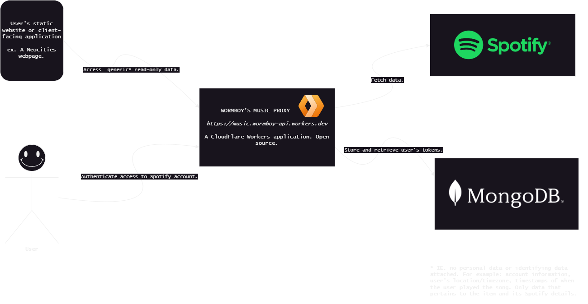
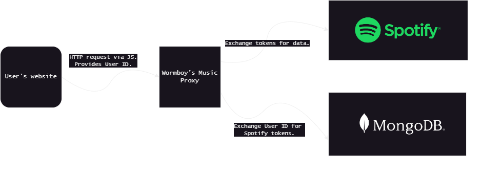

# Design Notes

This document details the design for this program. It is partially for my own self-reference.

> Reading this document is NOT required to use this API.


## Overall Design



The overall design of Wormboy's Music Proxy API involves five parties:

1. The Cloudflare worker @ https://music.wormboy-API.workers.dev/
2. Spotify's Web API
3. Mongo DB Atlas/Realms
4. The client: a website or service using this API.
5. The user: the developer of the website or service, who has authenticated Wormboy's Music Proxy API to access their data.

The following sections break down the responsibilities and roles of each party.


### The Cloudflare Worker

The Cloudflare Worker is made up of the contents of this repository. This code is reponsible for handling user or client interaction, and communicating with Spotify. This worker uses a small database hosted on Mongo DB, which it communicates with via Mongo Realms' data API with [custom endpoints](https://www.mongodb.com/docs/atlas/app-services/data-api/custom-endpoints/). See [here](#mongo-database) for what data is stored.


### Spotify's Web API

Spotify's Web API holds its users' listening data. The Cloudflare worker requests data from the Spotify Web API's relevant endpoints and provides the appropriate user tokens to fetch data.


### Mongo Database

The Cloudflare worker sends user access and refresh tokens to a Mongo database for storage. The database pairs these tokens to a unique user ID: an alphanumeric keysmash. On the registration of a new user, the database returns the new user's newly generated unique ID. On receiving a request from the worker, the database returns the appropriate tokens using the provided user ID.

> Note: the user ID is provided as a part of the url address, it is *not* a header. This is because there is no hiding the user ID anyway, the request is being made by a client-facing application.

> another note: there *are* some endpoints that do not require a user id. ie: endpoints for public playlist data. in these cases, the worker fetches the token for my account. I am comfortable with this because I intend for these endpoints to only access public data.
> ... should I rethink that???


### The Client

The Client is the user's website or application. For example, I will use a static Neocities site. When someone visits my neocities page, a JS script fetches my top five artists within the past four weeks from the Cloudflare worker. This file uses the following URL:

```https://music.wormboy-api.workers.dev/api/[USERID]/top/artists?limit=5&time_range=short_term```

In this URL, I provide the worker with:

- My user id.
- A query string specifying time range and how many artists.
    * Both fields have a default value if not provided.

The worker returns data in a format [specified here](./data-structures.md). My JS script anticipates this schema and uses it to build additional HTML elements on my page.


### The User

The user is a developer or webmaster who uses this API to display data on their website or application. They are responsible for:

- Authenticating their Spotify account via the `/register` endpoint.
- Making HTTP requests from the appropriate endpoints with their preferred queries, [documented here](./endpoints.md).
- Writing the code for their website or application that makes use of the provided data.


## Use Flow

To consolidate and summarize the processes described in the previous sections, this is the flow of action on client request:


