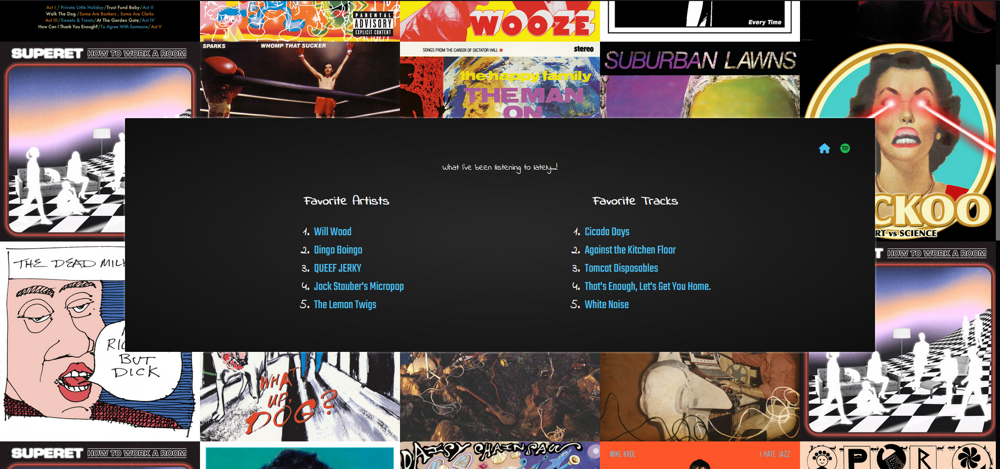

# Examples

This document lists a few simple example uses of Wormboy's Music Proxy API. It is intended to show off various possibilities, and offer code snippets for beginners.

- [A simple list of artists](#example-1-a-list-of-top-artists)
- [Listing songs from a playlist](#example-2-highlight-songs-from-a-playlist)
- [Creating a collage of album art](#example-3-album-art-collage)

Find other examples/template code [here](https://github.com/cryptiddddd/javascript-freebies), intended for use on Neocities.

> Note: This page talks about writing the JavaScript to use this API. I strongly suggest viewing the [endpoint](./endpoints.md) and [structure](./data-structures.md) documentation in order to understand what JSON information to expect from each endpoint.


## Example 1: A list of top artists.


> A screenshot from my site's [homepage](https://wormboy3.neocities.org).

My homepage has a list of my short-term top 5 artists. The Javascript that generates this list follows these steps:

1. Define where the list will go using an id, and `getElementById()`.
2. Create a function that handles the data.
    1. Parse the JSON from `this`.
    2. Check the data's status code.
    3. If successful, loop through `.data.items` and populate an `<ol>` element with `<li>` elements, each holding an `<a>` element.
    4. If failed, print status and message to console for debugging.
3. Create an XML/HTTP request.
    1. Set the `onload` function to the function from the previous step.
    2. Set the request to GET `https://music.wormboy-api.workers.dev/api/[user-id]/top/artists` with the query string `?limit=5&time_right=short_term`.
    3. Send request.

The JS looks something like this:
```js
// fill user id in here.
const USERID = "user-id-here";

let targetElement = document.getElementById("top-spotify-items");

// define function
function receiveResponse() {
    // parse
    let response = JSON.parse(this.responseText);

    // check status
    if (response.status != 200) {
        console.error(response.status, response.message);
        return;
    }

    // create ordered list
    let listElement = document.createElement("ol");

    for (let artist of response.data.items) {
        let listItem = document.createElement("li");
        let anchor = document.createElement("a");

        anchor.href = artist.spotifyURL;
        anchor.innerText = artist.name;
        anchor.target = "_blank";

        listItem.appendChild(anchor);
        listElement.appendChild(listItem);
    }

    targetElement.replaceChildren(listElement);
}

// create xmlhttp request
let request = new XMLHttpRequest();

// set onload
request.onload = receiveResponse;

// set url
request.open("GET", `https://music.wormboy-api.workers.dev/api/${USERID}/top/artists?limit=5&time_range=short_term`);

// send reqeust
request.send();
```


## Example 2: Highlight songs from a playlist.


In this example, under "today's music", the webmaster uses this API to fill in songs from a favorite playlist.

This code is very similar to the previous, only using different elements (and a touch of CSS) and a different endpoint.

Instead of the [top](./endpoints.md#get-apiuseridtoptype) endpoint, this site uses the [playlist](./endpoints.md#get-apiplaylistplaylistid) endpoint. Additionally, it uses some randomization to shuffle which songs display.


## Example 3: Album art collage.



This example page uses code similar to the first page, which it repeats for both artists and tracks. 

For the background collage, this site gets the user's 30 most recently played songs from the [recently played](./endpoints.md#get-apiuseridrecently-played) endpoint. It populates a fixed-position [CSS grid](https://developer.mozilla.org/en-US/docs/Web/CSS/CSS_Grid_Layout) with `` elements, one for each song played (see [song data](./data-structures.md#song-data) for how to retrieve album artwork).

## More examples to come...

But in the meantime, get inventive!
